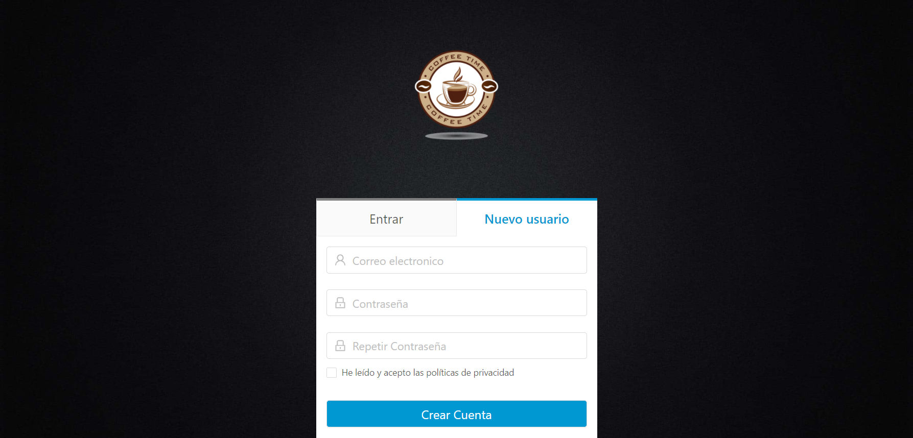
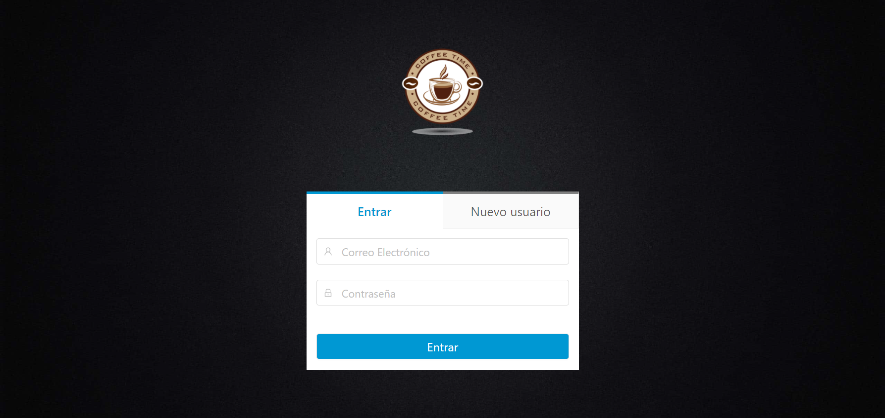
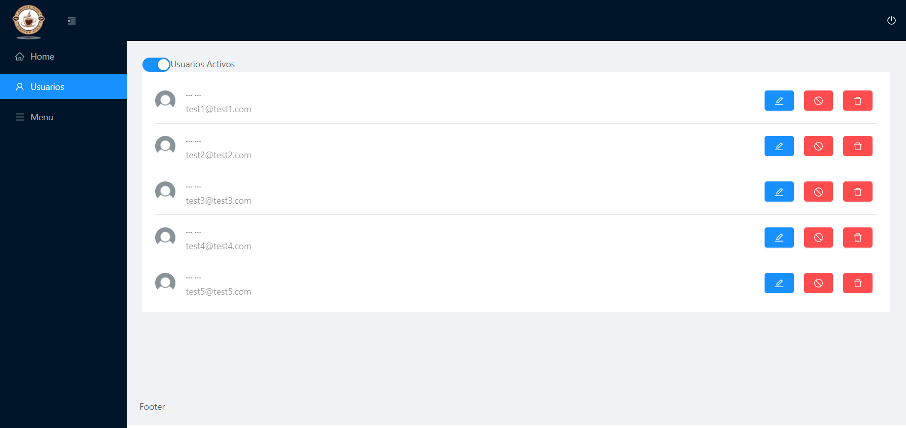
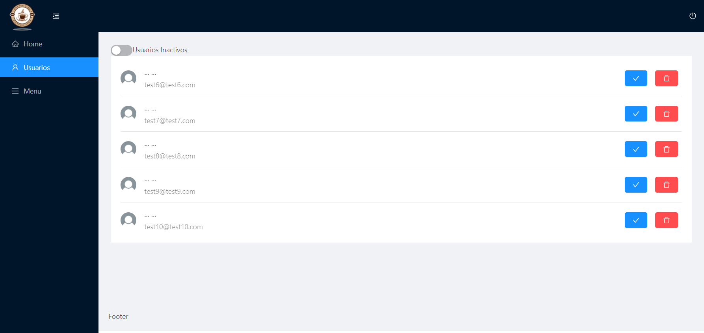
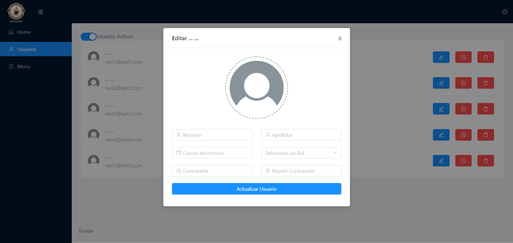
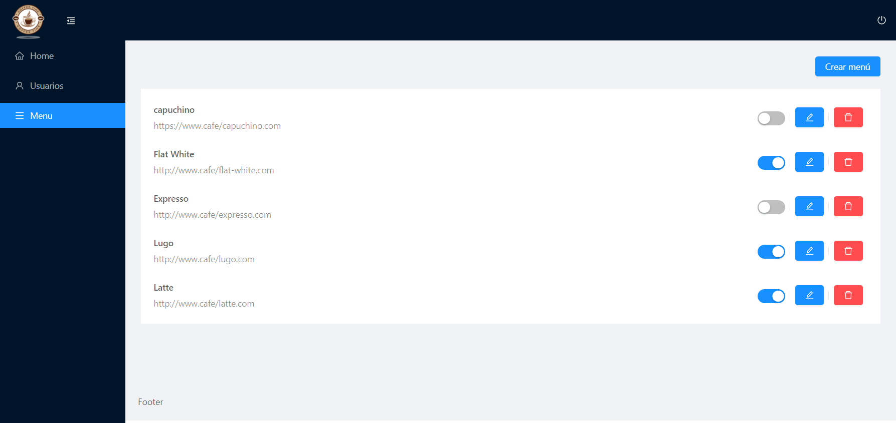
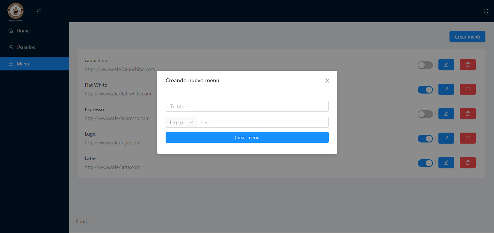

# Desarrollo del cliente para proyecto de NODEjs en ESCALAB

Desarrollo del cliente del proyecto de NODE - Escalab


## Creación del proyecto React
```bash
npx creact-react-app client
```

## Dependencias de Front-End
```bash
yarn add node-sass@5.0.0
yarn add antd@3.23.2
yarn add jwt-decode@3.1.2
yarn add moment@2.24.0
yarn add query-string@6.10.1
yarn add react-drag-sortable@1.0.6
yarn add react-dropzone@11.4.2
yarn add react-helmet@5.2.1
yarn add react-router-dom@^5.3.0
yarn add react-scripts@4.0.3
yarn add web-vitals@^1.0.1

```

## Codigos GIT
```bash
# Revisar logs
git log --pretty=oneline
#Cargar cambios y versiones
git branch -M main
git push -u origin main
# Generar Tags
           (Version) 
git tag -a V1.0.0 -m "Mensaje"
git push --tags
#branches (Ramas)
git add .
git checkout -b room
git commit -m "Agregado de dependencias"
git push origin room
#Unir Ramas a main
git checkout main
git merge <Nombre Rama> -m "Mensaje rama"
```
## Demostración del proyecto

### Home


### Register


### Login


### Usuarios







### Menu


